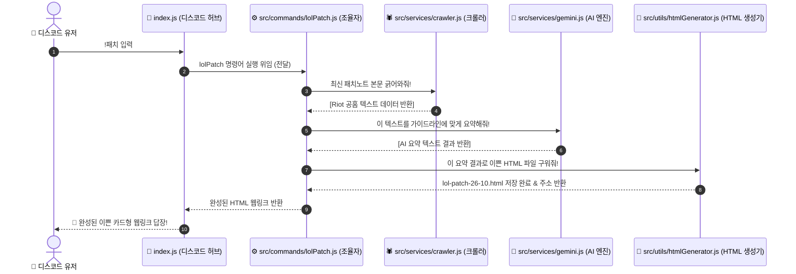

# 🎮 N_GameDiscordBot 프로젝트 계획서 (Project Plan)

이 문서는 **N_GameDiscordBot**의 전체 모듈형 파일 구조, 관심사 분리(SRP) 설계 및 동작 흐름 시퀀스 다이어그램을 설명하는 시스템 설계서입니다.

---

## 📂 1. 모듈형 소스코드 구조 (Modular Directory Structure)

비즈니스 로직과 플랫폼 인터페이스가 엄격히 분리되어, 유지보수가 용이하고 추후 에이전트 이전 시 이식성이 최적화된 아키텍처입니다.

```text
N_GameDiscordBot/
├── src/                  # [Source] 봇 구동 진짜 자바스크립트 코드들의 안전 금고
│   ├── services/         # [Services] 핵심 외부 통신 및 가공 레이어
│   │   ├── crawler.js    # 🕷️ [역할 1] Riot 공식 홈페이지 HTML 크롤러
│   │   └── gemini.js     # 🧠 [역할 3] Gemini AI 요약 엔진 (타 LLM 교체 가능)
│   ├── utils/            # [Utils] 유틸리티 도움 레이어
│   │   └── htmlGenerator.js # 🎨 [역할 2] AI 요약본을 이쁜 HTML 문서로 렌더링 및 저장
│   └── commands/         # [Commands] 명령어 비즈니스 로직 조율 레이어
│       └── lolPatch.js   # ⚙️ [컨트롤러] 롤 패치 조회 명령 총괄 핸들러
├── public/               # [Cache] 외부 접근이 허용된 정적 파일 호스팅 구역
│   └── rendered/         # 생성된 lol-patch-26-10.html 정적 캐시 문서들이 저장되는 곳
├── .env                  # [보안] 디스코드 봇 토큰 및 GEMINI_API_KEY 보관
├── .gitignore            # [보안] 깃허브 제외 규칙
├── package.json          # Node.js 패키지 의존성 파일
├── index.js              # 🤖 [허브] 프로젝트 대문 (로그인 및 단순 명령어 라우팅 전담)
└── PROJECT_PLAN.md       # 📄 [설계서] 봇 모듈 아키텍처 및 동작 다이어그램 (현재 파일)
```

---

## 🗺️ 2. 시스템 동작 흐름도 (Sequence Diagram)

사용자님이 맘에 들어 하신 봇의 실시간 크롤링 및 AI HTML 변환 연산의 유기적 데이터 시퀀스 흐름도입니다. 
*(VS Code의 Markdown Preview나 GitHub에서 이쁜 그림으로 즉시 렌더링됩니다.)*



---

## 🔍 3. 각 모듈의 명확한 역할 설명

1. **`index.js` (대문)**: 
   * 디스코드 서버와 접속(로그인)을 맺고 유저의 채팅을 듣습니다. 명령어가 들어오면 직접 해결하지 않고 해당하는 `/src/commands/` 안의 조율자 파일로 신속히 교통정리해 넘깁니다.
2. **`src/commands/lolPatch.js` (조율자)**: 
   * 전체적인 서비스 스토리를 통제합니다. 크롤러를 깨워 텍스트를 가져오게 하고 ➔ 이를 AI에게 던져 요약하게 한 뒤 ➔ 요약본을 HTML 빌더에게 전달해 파일로 굽게 한 다음 ➔ 최종 완성 링크를 디스코드 채널로 보내는 전 과정을 감독합니다.
3. **`src/services/crawler.js` (크롤러)**:
   * 오직 외부 인터넷 망에 접근하여 롤 공식 웹사이트 기사들을 분석하고 본문 텍스트를 발라내어 리턴하는 일에만 집중합니다.
4. **`src/services/gemini.js` (AI 연동)**:
   * `.env` 속 `GEMINI_API_KEY`를 로드하여 구글 AI 서버와 연결하고, 지정된 프롬프트 규칙에 따라 텍스트를 정돈하여 응답받는 역할을 전담합니다.
5. **`src/utils/htmlGenerator.js` (HTML 렌더러)**:
   * AI가 보내준 정돈된 정보를 받아, 가독성이 뛰어난 CSS 스타일의 멋진 HTML 마크업으로 템플릿화하여 하드디스크에 물리적인 파일(`.html`)로 적재하는 작업을 수행합니다.
